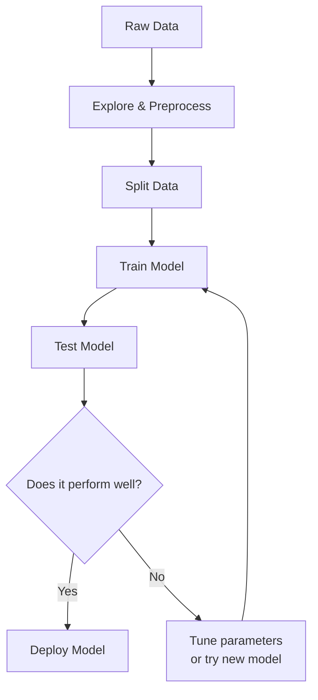

Machine learning projects generally follow a structured 7-step pipeline. Understanding this workflow is important for keeping your ML projects organized and effective.

### 1. Define the Problem

Before writing any code, you need to establish a clear goal. This step involves figuring out exactly what you are trying to predict, understanding what data you currently have or need to acquire, and defining what a successful model would look like (e.g., reaching 90% accuracy).

### 2. Collect and Explore Data

Data is the foundation of any machine learning model. In this phase, you find and load your dataset and begin exploring its structure. Visualizing patterns, inspecting different features, and understanding the distribution of the data will help guide your modeling decisions later on. For real-world projects, you may also be required to build your own datasets.

### 3. Prepare the Data

Raw data is rarely ready to be fed directly into a model. During data preparation, you will handle missing values, remove or fix outliers, scale numerical features so they are all on a similar scale, and encode categorical variables (like turning "Red" and "Blue" into numbers).

### 4. Split the Data

To evaluate how well your model will perform in the real world, you cannot test it on the same data it learned from. Thus, you split your data into a **Training set** (usually 70-80% of the data) which is used to teach the model, and a **Test set** (the remaining 20-30%) which is kept hidden and used solely to evaluate its final performance. This is done to prevent overfitting, where the model memorizes the training data instead of learning generalizable patterns. You may also choose to use cross-validation instead, where the data is split into several folds, and the model is trained and evaluated multiple times across different combinations of these folds to ensure a more robust performance estimate.

### 5. Train the Model

Now it's time to choose machine learning algorithm(s) that fits your problem. You will feed the training data into the algorithm, allowing it to "fit" the model and learn the underlying mathematical patterns and relationships that connect your features to your target labels.

### 6. Evaluate Performance

Once the model is trained, you evaluate its performance by having it make predictions on the hidden test set. By comparing the model's predictions to the actual answers, you can calculate metrics like accuracy, precision, and recall. This step confirms whether your model truly learned the patterns or just memorized the training data.

### 7. Deploy and Monitor

A successful model doesn't just sit on your laptop. Deployment involves integrating the model into a production environment (like a web app or an API) so users can interact with it. From there, you must continuously monitor the model, watching out for "data drift" (when real-world data changes over time) and retraining the model when its performance begins to degrade.

## Visual Overview

A high-level view of this pipeline might look like this:

## What's in this chapter?

- **Train-Test Split**: Learn about the importance of splitting your data and how to do it.
- **Activity: Splitting Data**: Hands-on practice using `train_test_split()`.

Let's get started!