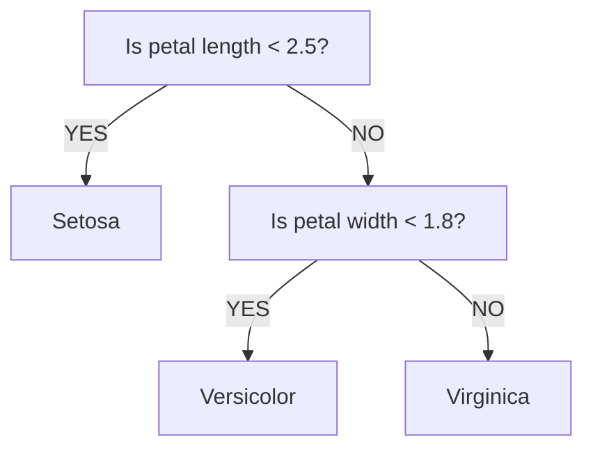

Decision trees learn a series of if-then rules by splitting data into increasingly pure groups. They're visual, interpretable, and powerful.

## Abstract Concept

A decision tree works much like a flowchart, asking a series of simple yes/no questions to sort data into specific categories. At each step (called a **node**), the algorithm looks at the available information and picks the question that naturally does the best job of splitting the data apart. This branching process continues over and over until it hits a stopping point (like a maximum number of questions), or until the final sorted groups (called **leaves**) only contain a single category.



In the example above, the very first question (the **root node**) checks if the petal length is less than 2.5. If the answer is yes, the tree immediately classifies the flower as "Setosa." If the answer is no, it moves down the branch to the next question (the next **node**) to check if the petal width is less than 1.8. Depending on that answer, the data lands in one of the final outcomes (the **leaves**), classifying the flower as either "Versicolor" or "Virginica."

The selection of the best feature and threshold to split the data at each node is determined by a metric called **information gain**, which measures how much the uncertainty of the data is reduced by the split. The algorithm picks the feature and threshold that maximizes information gain, and repeats this process until the data is split into pure groups (i.e., all data points in a leaf belong to the same class) or until a stopping condition is met.

## Code Example

```python
from sklearn.tree import DecisionTreeClassifier
from sklearn.datasets import load_iris
from sklearn.model_selection import train_test_split
from sklearn import tree

# Load data
iris = load_iris()
X, y = iris.data, iris.target

# Split
X_train, X_test, y_train, y_test = train_test_split(
    X, y, test_size=0.2, random_state=42
)

# Create and train model
model = DecisionTreeClassifier(max_depth=3, random_state=42)
model.fit(X_train, y_train)
```

Here, we initialize `DecisionTreeClassifier()`. It is also possible to use `DecisionTreeRegressor()` for regression tasks. Scikit-learn will automatically find the best feature and threshold to create "nodes" by calculating information gain.

## Key Hyperparameters

Decision Trees are notoriously prone to overfitting, as they will memorize the training data perfectly if you let them grow deep enough to create tiny, strict branches for every outlier. Hence, the hyperparameters here are crucial for "pruning" the tree so that it generalizes well to unseen data.

- **`max_depth`:** The maximum depth of the tree (default is `None`, and will continue splitting until all leaves are pure). A shallow tree is simple, fast, and highly interpretable, but may be too simple to capture the underlying patterns in the data. A deep tree will remember the training data perfectly but almost certainly will not generalize well to unseen data.
- **`min_samples_split`:** The minimum number of samples required to split an internal node (default is `2`). Increasing this prevents the model from splitting a node that only contains a handful of samples.
- **`min_samples_leaf`:** The minimum number of samples required to be at a leaf node (default is `1`). Increasing this guarantees that every final branch has enough support data to be statistically meaningful.
- **`criterion`:** The mathematical function to measure the quality of a split. Supported criteria are `'gini'` for the Gini impurity and `'log_loss'` or `'entropy'` for the Shannon information gain.

## When to Use Decision Trees

- **Need interpretable models:** You can plot a decision tree using `tree.plot_tree()` and let non-technical audience follow the logic as it makes predictions.
- **Want to understand feature importance:** Decision trees natively calculate how "important" each feature was in making splits. After training a tree, you can access an array of scores representing the relative importance of each feature via `model.feature_importances_`.
- **Have lots of mixed data types:** They naturally handle categorical data and require very little data preprocessing.
- **Dealing with non-linear relationships:** The "step-wise" branching logic of a tree is excellent at dividing data that doesn't follow strict linear lines.
